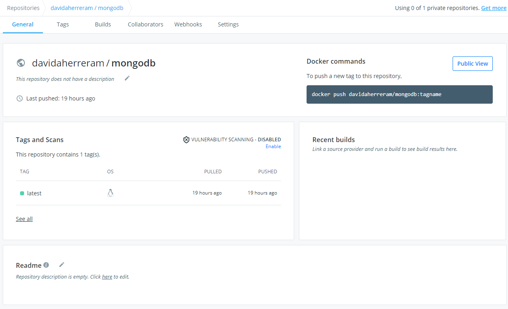

## AREP-2021 LAB-5

Este proyecto cuenta de un servicio de para obtener e insertar datos a una base de datos no relacional que es MongoDb,
ademas el objetivo principal de este proyecyto es aprender a manejar dockers e imagenes de este esrvicio, subiendo estas imagenes 
a dockers que tenemos en maquinas de aws

### Prerequisitos

- Maven: Esta es la herramienta encargada de la creacion del proyecto y ayuda a manejar la despedencias del mismo
- Git: Software de control de versiones.
- JDK: Es la herramienta que sirve para desarrollar en java, versiones de este programa desde la 8 en adelante.
- docker: Es la herramienta que le va a ayudar a crear usar los comandos de docker en su pc

### Instalacion

 Para poder instalar el programa debe clonar este repositorio en su computador, esto lo puede hacer con el sigueinte comando.
 >https://github.com/DavidAndresHerrera/AREP-LAB5.git

 antes de clonar el proyecto en su maquina local verifique la ubicacion donde quiere dejar el proyecto.
 
### Ejecucion y empaquetado

Para empaquetar y ejecutar el programa usando maven ingresa el siguiente comando dentro de la carpeta Media_DsvEstandar-app
> mvn package

Cuando ya el proyecto ha compilado, puede proceder a ejecutarlo, use el siguiente comando sobre el directorio SparkWebApp

> java -cp target/AWSlab-1.0-SNAPSHOT.jar edu.escuelaing.arep.server.SparkWeb

### Creacion y Vistas del servicio

Para crear la imagen y subir la imagen a docker hub se usan los siguientes comandos:

> docker build --tag lab5service .
> 
> docker tag lab5service davidaherreram/lab5service
> 
> docker push davidaherreram/lab5service:latest

Verificamos que las imagenes esten en dockerhub 

Luego de tener las imagenes en docker hub se montan las imagenes al docker de la maquina virtual de AWS y se corren con el sigueinte comando

> docker run -d -p 35002:6000 --name lab5servicedocker davidaherreram/lab5service

creamos 3 instancias de la imagen del servicio en la maquina virtual y se hace lo mismo con la imagen de mongo pero solo se crea una instancia para esa imagen

Asi ve el usuario al ingresar 

Cuando probamos la aplicacion y obtenemos los datos se ve algo asi:

### Ejecucion de pruebas

Despues de empaquetado el programa y saber que esta corriendo de manera correcta ingresa el sigueitne comando
> mvn test

Ademas si quiere probar la pagina puede usar post man y se veria algo asi 

servicio de insertar 

servicio de get

### Integracion continua

En este link puede encontrar la integracion continua en CircleCi

### Licencia
GNU General Public License v3.0 

### Autor 

#### David Andres Herrera Moya 
